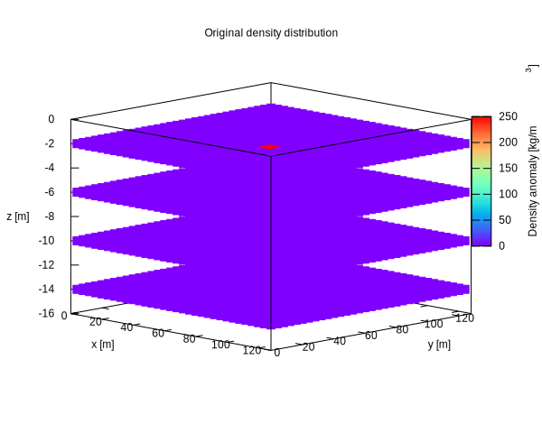
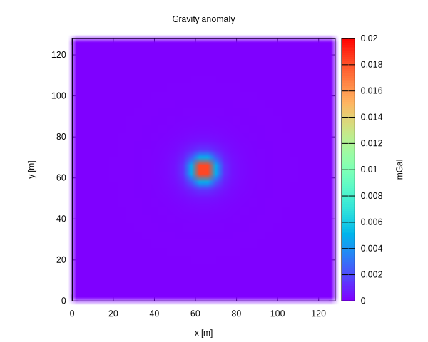
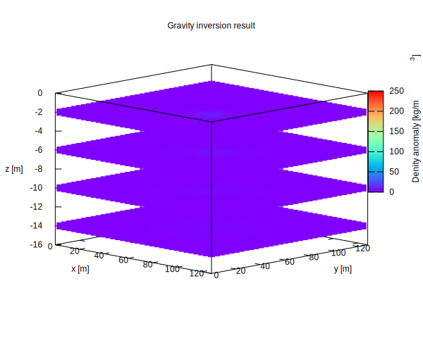

# Gravity Inversion

Gravity inversion is a classical inverse problem in geophysics.
Its objective is to estimate the subsurface density distribution from gravity measurements observed at or near the Earth's surface.

Unlike polynomial fitting, gravity inversion is typically an **underdetermined** least-squares problem.
This makes it a representative application of the minimum-norm solution provided by LSQSolver.

The purpose of this example is not to claim that the minimum-norm solution is always a geologically meaningful density model.
Rather, this example shows an important point:

> In an underdetermined inverse problem, the solution is not unique.
> LSQSolver returns the minimum-norm solution, but the minimum-norm assumption is itself a modeling choice.
> If this assumption does not match the intended prior information, the recovered model may differ from the expected physical or geological model.

Therefore, users should understand what kind of solution is selected by their problem formulation and introduce appropriate weights, regularization terms, bounds, or other prior information when necessary.

---

## Problem formulation

Suppose the underground region is discretized into rectangular cells, or voxels.

Let

- $\rho_j$ : density contrast of voxel $j$
- $g_i$ : gravity anomaly observed at observation point $i$

Collecting all observations gives the linear system

$$
A\rho = g,
$$

where

- $A$ : sensitivity matrix
- $\rho$ : unknown density contrast vector
- $g$ : observed gravity anomaly vector

The sensitivity matrix describes how each voxel contributes to each gravity observation.

In this document, $\rho$ should be interpreted as a **density contrast**, not necessarily the absolute rock density.
For example, if the background density is $\rho_0$, then

$$
\rho = \rho_{\mathrm{rock}} - \rho_0.
$$

Typical density contrasts used in synthetic examples are on the order of $100$--$500\ \mathrm{kg/m^3}$.

---

## Sensitivity matrix

For a point observation at $(x_i,y_i,z_i)$ and a voxel $V_j$, the vertical gravity contribution is modeled by

$$
A_{ij}
=
G
\iiint_{V_j}
\frac{z_i-z}
{\left[
(x_i-x)^2
+
(y_i-y)^2
+
(z_i-z)^2
\right]^{3/2}}
\,dV,
$$

where

- $G$ : gravitational constant
- $(x_i,y_i,z_i)$ : observation point
- $V_j$ : voxel corresponding to unknown $\rho_j$

This integral has a closed-form analytical solution for rectangular prisms.
For a simple numerical example, it can also be approximated by evaluating the kernel at the voxel center and multiplying by the voxel volume:

$$
A_{ij}
\approx
G |V_j|
\frac{z_i-z_j}
{\left[
(x_i-x_j)^2
+
(y_i-y_j)^2
+
(z_i-z_j)^2
\right]^{3/2}},
$$

where $(x_j,y_j,z_j)$ is the center of voxel $j$.

Depending on implementation, the factor $G$ may be included either in the sensitivity matrix or applied later when converting the computed anomaly to physical units.
For example, if the matrix is assembled without $G$, the synthetic anomaly can be converted to $\mathrm{m/s^2}$ by multiplying by $G$.
To display the result in mGal, use

$$
1\ \mathrm{mGal} = 10^{-5}\ \mathrm{m/s^2}.
$$

---

## Why is the problem underdetermined?

In a typical gravity inversion setup, the number of unknown density cells is larger than the number of observations.
For example, a $32 \times 32$ observation grid and a $32 \times 32 \times 4$ subsurface mesh give

$$
m = 1024,\qquad n = 4096,
$$

so that

$$
A \in \mathbb{R}^{1024\times4096},
\qquad m<n.
$$

Therefore, many density models can reproduce the same gravity observations.
LSQSolver gives one well-defined choice: the **minimum-norm solution**.
That is, among the least-squares solutions, it selects the one with the smallest Euclidean norm.

This is useful, but it is not assumption-free.
Without appropriate prior information, an underdetermined inverse problem does not necessarily produce a physically appropriate model.

---

## Algorithm overview

The example follows a simple synthetic inverse-problem workflow.

1. Discretize the observation surface and the subsurface domain.
2. Assemble the sensitivity matrix \(A\).
3. Define a synthetic true density contrast model \(\rho_{\mathrm{true}}\).
4. Compute the corresponding gravity anomaly

$$
g = A\rho_{\mathrm{true}}.
$$

5. Solve the underdetermined inverse problem

$$
A\rho \approx g
$$

using LSQSolver.
6. Compare the recovered minimum-norm model \(\rho_{\mathrm{est}}\) with the prescribed model \(\rho_{\mathrm{true}}\).

The important point is that the inverse step does not attempt to recover the original synthetic model directly.
It computes the minimum-norm solution selected by the algebraic problem formulation.

---

## Experimental design and results

The experiments are intentionally simple.
They are designed to show that the minimum-norm solution is a well-defined algebraic solution, but not necessarily the physical density model intended by the user.

### Experiment 1: forward model sanity check

First, place a positive density contrast near the center of the subsurface domain and close to the observation surface.
Then compute the gravity anomaly by

$$
g = A\rho_{\mathrm{true}}.
$$

The gravity anomaly should have a smooth hotspot approximately above the density anomaly.
This confirms that the mesh indexing, sign convention, observation position, and unit conversion are consistent.

  
  

### Experiment 2: minimum-norm inversion

Next, solve the inverse problem using the synthetic gravity anomaly from Experiment 1.
Because the number of density cells is larger than the number of observations, there are many density models that can explain the same synthetic gravity anomaly.
LSQSolver selects the minimum-norm solution among them.

For a noise-free synthetic example, the residual should be small:

$$
\|A\rho_{\mathrm{est}} - g\|_2 \approx 0.
$$

However, the recovered model \(\rho_{\mathrm{est}}\) does not necessarily match the prescribed model \(\rho_{\mathrm{true}}\).
This is not a failure of the solver.
It is a consequence of the non-uniqueness of the underdetermined inverse problem.

### Experiment 3: depth ambiguity

Finally, repeat the experiment with a density block placed deeper in the subsurface domain, while keeping the same horizontal location.

As the true density anomaly becomes deeper, the surface gravity anomaly becomes smoother and weaker.
When the inverse problem is solved without additional prior information, the recovered minimum-norm model may place the density anomaly closer to the observation surface than the true model.

This illustrates the main message of this example:

> The minimum-norm solution is mathematically well defined, but it is not necessarily the density model intended by the user.

  
  

A compact result table may be included as follows.

| Case | Rows | Cols | Rank | \(\|g\|_2\) |  \(\|\rho_{\mathrm{true}}\|_2\) | \(\|\rho_{\mathrm{est}}\|_2\) |
|:-:|:--:|:--:|:--:|:--:|:--:|:--:|
| shallow | 1024 | 4096 | 1024 | 5887 | 500 | 474.4 |
| deep | 1024 | 4096 | 1024 | 1318 | 500 | 44.44 |

To make the depth ambiguity more explicit, it is also useful to report the depth of the largest density value.

| Case | true max depth | revered max depth |
|---|:--:|:--:|
| shallow | -2.0 | -2.0 |
| deep | -14.0 | -2.0 |

---

## Discussion

The important point is that LSQSolver solves the algebraic problem provided by the user.
For an underdetermined system, it returns the minimum-norm solution.
This is often a useful default choice, but it should not be confused with a unique physical reconstruction.

The key question is therefore:

> What prior information should the solution satisfy?

If no appropriate prior information is included, an underdetermined inverse problem can fit the observations while producing a density model that is not physically or geologically appropriate.
In gravity inversion, examples of prior information include expected depth range, smoothness, bounds on density contrast, sparsity, or known geological interfaces.

Such assumptions are not determined by LSQSolver.
They must be introduced by the user through the problem formulation.
One common way to do this is to reformulate the problem using weights or regularization terms, as summarized in the appendix.

---

## Summary

This example demonstrates how LSQSolver can solve a dense underdetermined least-squares problem arising in gravity inversion.

The main lesson is not only that the system can be solved, but also that the returned solution has a specific meaning:

- the problem is underdetermined,
- infinitely many density models may fit the same gravity data,
- LSQSolver returns the minimum-norm solution,
- and the minimum-norm solution may not match the user's physical prior.

Therefore, when applying LSQSolver to inverse problems, users should carefully ask what prior information is needed for the solution to be meaningful.
If the plain minimum-norm assumption is not appropriate, that prior information should be expressed by reformulating the problem, for example with weights, regularization terms, constraints, or other model assumptions.

The same formulation is applicable to many inverse problems in science and engineering where the relationship between unknown parameters and observations can be expressed as

$$
A x \approx b.
$$

---

## Appendix: Regularization and prior information

This section is a short supplement to the discussion above.
Regularization is not a way to remove assumptions from the inverse problem.
It is a way to express the user's prior information as part of the least-squares problem.

A common form is Tikhonov regularization:

$$
\min_{\rho}
\left(
\|A\rho-g\|_2^2
+
\lambda^2\|L\rho\|_2^2
\right),
$$

where \(L\) represents the chosen prior model and \(\lambda\) controls its strength.
For example, \(L=I\) penalizes large density contrasts, while a difference operator penalizes rough density models.

This can be written as an ordinary least-squares problem:

$$
\begin{bmatrix}
A \\
\lambda L
\end{bmatrix}
\rho
\approx
\begin{bmatrix}
g \\
0
\end{bmatrix}.
$$

Thus, to use LSQSolver, define

$$
\widehat{A} =
\begin{bmatrix}
A \\
\lambda L
\end{bmatrix},
\qquad
\widehat{g} =
\begin{bmatrix}
g \\
0
\end{bmatrix},
$$

and solve

$$
\widehat{A}\rho \approx \widehat{g}.
$$

The solver then treats this as a standard least-squares problem.
The modeling choices are contained in \(L\) and \(\lambda\), not in the solver itself.

A weighted minimum-norm formulation can be handled in the same spirit.
If the desired criterion is \(\|W\rho\|_2\), set \(y=W\rho\), solve

$$
A W^{-1} y \approx g,
$$

and recover \(\rho=W^{-1}y\).
