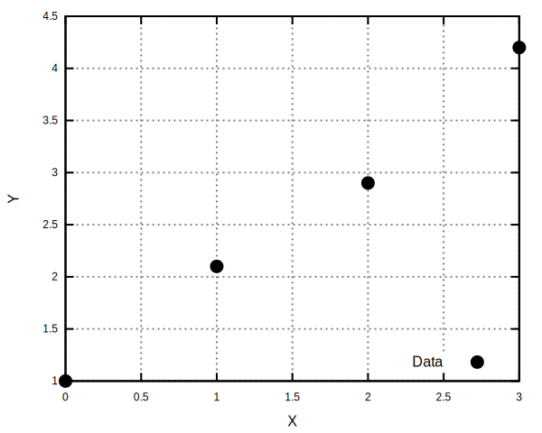
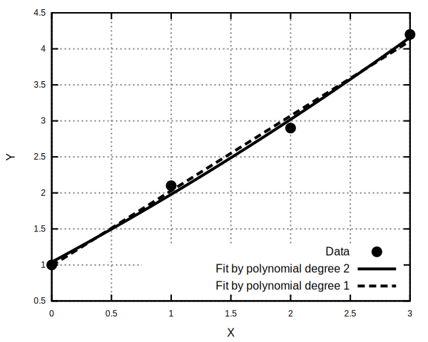
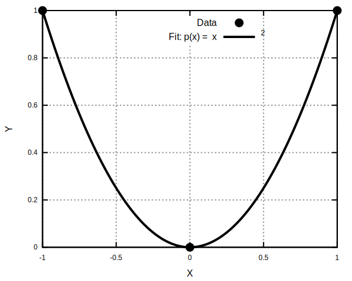
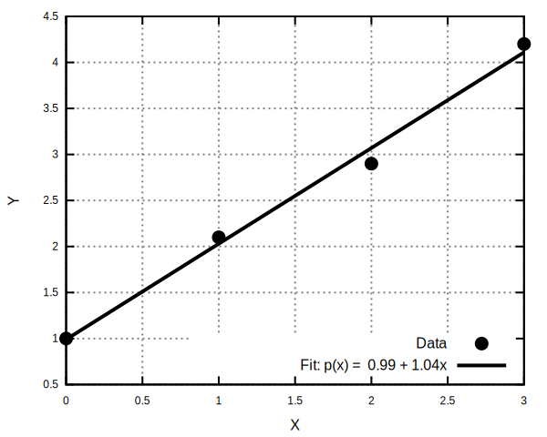
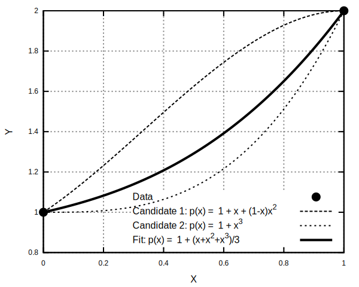
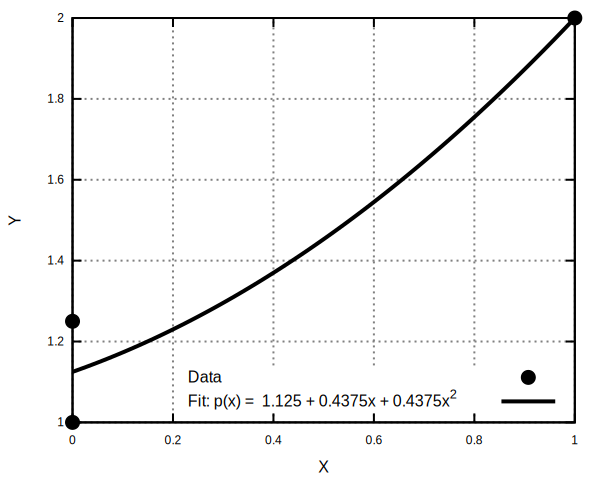

# 多項式の当てはめ

## 概要

このページでは、多項式の当てはめを題材にして、`LSQSolver` の基本的な使い方を説明します。多項式の当てはめとは、いくつかの点が与えられたときに、それらの点の近くを通る直線や曲線を求めます問題です。たとえば、次のようなデータがありますとします。

```text
x: 0, 1, 2, 3
y: 1.0, 2.1, 2.9, 4.2
```

この点列に対して、直線や2次曲線などを当てはめます。散布図に示すと以下のようになります。



なお、`LSQSolver` は多項式フィット専用のライブラリではありません。`LSQSolver` は、行列とベクトルで表される線形の最小二乗問題を解くためのライブラリです。このページでは、多項式の当てはめを、`LSQSolver` が扱える線形最小二乗問題に書き換えられる例として説明します。

---

## 多項式の当てはめの数式化

ここでは、データ点に多項式を当てはめることを考えます。まず、データ点を $`(x_1, y_1), (x_2, y_2), \ldots, (x_m, y_m)`$ と書くことにします。ここで、$`m`$ はデータ点の数、$`x_i`$ は $`i`$ 番目の点の横軸の値、$`y_i`$ は $`i`$ 番目の点の縦軸の値です。

たとえば、2次式を使う場合、多項式は次の形になります。

```math
p(x) = c_0 + c_1 x + c_2 x^2.
```

ここで、$`p(x)`$ は $`x`$ に対して計算される曲線上の値であり、$`c_0, c_1, c_2`$ は多項式の形を決める係数です。この係数 $`c_0, c_1, c_2`$ が、ここで求めたい値です。係数の値を変えると、曲線の形が変わります。つまり、多項式の当てはめとは、与えられた点にできるだけよく合うように、曲線の形を決めることです。

たとえば、点がだいたい一直線に並んでいれば直線を使います。点が少し曲がった形に並んでいれば、2次式や3次式を使うと、より自然に合うことがあります。



ここで重要なのは、`LSQSolver` が多項式そのものを特別扱いしているわけではない、という点です。多項式の係数 $`c_0, c_1, c_2`$ を未知数とみなすと、この問題は行列とベクトルを使った線形の問題として書けます。`LSQSolver` は、その線形問題を解いて係数を返します。

C# では、まず多項式の係数に対応する行列 `A` を作り、それを `LSQSolver.Solve()` に渡します。たとえば、2次式の場合は次のように計算できます。

```csharp
double[] xs = { 0.0, 1.0, 2.0, 3.0 };
double[] ys = { 1.0, 2.1, 2.9, 4.2 };

// p(x) = c0 + c1 x + c2 x^2
double[][] data =
{
    new double[] { 1.0, xs[0], xs[0] * xs[0] },
    new double[] { 1.0, xs[1], xs[1] * xs[1] },
    new double[] { 1.0, xs[2], xs[2] * xs[2] },
    new double[] { 1.0, xs[3], xs[3] * xs[3] }
};

var A = new MatrixObject(data);
var result = Solve(A, ys, overwrite: false);

double[] c = result.Solution;

Console.WriteLine($"p(x) = {c[0]} + {c[1]} x + {c[2]} x^2");
Console.WriteLine($"residual = {result.ResidualNorm}");
```

出力：

```console
p(x) = 1.0399999999999996 + 0.890000000000001 x + 0.04999999999999968 x^2
residual = 0.17888543819998348
```

このコードでは、`xs` に横軸の値、`ys` に縦軸の値を入れています。`result.Solution` に、多項式の係数 $`c_0, c_1, c_2`$ が入ります。

与えられた点に当てはまる多項式について、点の数、多項式の次数、データの重複によって、以下の状況が起こりえます。

1. ただひとつに決まる場合
2. すべての点を正確には通れない場合
3. 答えがたくさんある場合
4. ランクが落ちる場合

以下では、数学的な事前知識をあまり仮定せずに、状況1〜3を図とコードで説明します。その後、線形代数の言葉で整理し、状況4であるランクが落ちる場合を説明します。

---

## 状況1：与えられた点に当てはまる多項式が、ただひとつに決まる場合

まず、点の数と、決めたい値の数がちょうど合っている場合を考えます。たとえば、2次式

```math
p(x) = c_0 + c_1 x + c_2 x^2
```

には、決めたい係数が3つあります。このとき、データ点が3つあれば、うまくいく場合には、その3点をちょうど通る2次式を求めることができます。例として、次の3点を考えます。

```math
(-1, 1),\quad (0, 0),\quad (1, 1).
```

この3点を通る2次式は次の通りです。

```math
p(x) = x^2
```

実際に次が成り立つので、3点を正確に通っています。

```math
p(-1) = 1,\qquad p(0) = 0,\qquad p(1) = 1.
```



`LSQSolver` ライブラリを利用した計算コードは以下の通りです。

```csharp
double[] xs = { -1.0, 0.0, 1.0 };
double[] ys = {  1.0, 0.0, 1.0 };

// p(x) = c0 + c1 x + c2 x^2
double[][] data =
{
    new double[] { 1.0, xs[0], xs[0] * xs[0] },
    new double[] { 1.0, xs[1], xs[1] * xs[1] },
    new double[] { 1.0, xs[2], xs[2] * xs[2] }
};

var A = new MatrixObject(data);
var result = Solve(A, ys, overwrite: false);

double[] c = result.Solution;

Console.WriteLine($"p(x) = {c[0]} + {c[1]} x + {c[2]} x^2");
Console.WriteLine($"residual = {result.ResidualNorm}");
```

出力：

```console
p(x) = -0 + -0 x + 1 x^2
residual = 0
```

この場合、`residual` が0になります。これは、求めた曲線が与えられた点を正確に通っていることを意味します。

---

## 状況2：与えられた点に当てはまる多項式について、点が多く、全部の点を正確には通れない場合

次に、点の数が多い場合を考えます。たとえば、直線

```math
p(x) = c_0 + c_1 x
```

で4つの点を通そうとします。

```math
(0, 1.0),\quad (1, 2.1),\quad (2, 2.9),\quad (3, 4.2).
```

この4点は、だいたい直線上にあります。しかし、完全に一直線上に並んでいるわけではありません。そのため、「全部の点を正確に通る直線」はありません。このような場合でも、全体としてよく合う直線を求めることはできます。



`LSQSolver` ライブラリを利用した計算コードは以下の通りです。

```csharp
double[] xs = { 0.0, 1.0, 2.0, 3.0 };
double[] ys = { 1.0, 2.1, 2.9, 4.2 };

// p(x) = c0 + c1 x
double[][] data =
{
    new double[] { 1.0, xs[0] },
    new double[] { 1.0, xs[1] },
    new double[] { 1.0, xs[2] },
    new double[] { 1.0, xs[3] }
};

var A = new MatrixObject(data);
var result = Solve(A, ys, overwrite: false);

double[] c = result.Solution;

Console.WriteLine($"p(x) = {c[0]} + {c[1]} x");
Console.WriteLine($"residual = {result.ResidualNorm}");
```

出力：

```console
p(x) = 0.9900000000000004 + 1.0399999999999998 x
residual = 0.2049390153191921
```

この場合、`residual` は0にはなりません。これは、直線がすべての点を正確には通っていないことを意味します。それでも `LSQSolver` は、全体として点に近い直線を返します。

---

## 状況3：与えられた点に当てはまる多項式が、たくさんある場合

今度は、点の数に対して、決めたい値が多すぎる場合を考えます。たとえば、2つの点だけが与えられているとします。

```math
(0, 1),\quad (1, 2).
```

この2点を通る直線は1つに決まります。しかし、3次式

```math
p(x) = c_0 + c_1 x + c_2 x^2 + c_3 x^3
```

でこの2点を通ろうとすると、答えは1つに決まりません。2つの点を通る3次曲線は、たくさん作れてしまいます。



`LSQSolver` ライブラリを利用した計算コードは以下の通りです。

```csharp
double[] xs = { 0.0, 1.0 };
double[] ys = { 1.0, 2.0 };

// p(x) = c0 + c1 x + c2 x^2 + c3 x^3
double[][] data =
{
    new double[] { 1.0, xs[0], xs[0] * xs[0], xs[0] * xs[0] * xs[0] },
    new double[] { 1.0, xs[1], xs[1] * xs[1], xs[1] * xs[1] * xs[1] }
};

var A = new MatrixObject(data);
var result = Solve(A, ys, overwrite: false);

double[] c = result.Solution;

Console.WriteLine($"p(x) = {c[0]} + {c[1]} x + {c[2]} x^2 + {c[3]} x^3");
Console.WriteLine($"residual = {result.ResidualNorm}");
```

出力：

```console
p(x) = 0.9999999999999999 + 0.33333333333333326 x + 0.3333333333333332 x^2 + 0.3333333333333335 x^3
residual = 0
```

この場合、点を通る曲線はたくさんあります。`LSQSolver` は、その中から、係数が極端に大きくなりにくい自然な答えを選びます。ここで大事なのは、点をよく表す答えが複数あるとき、`LSQSolver` はその中から扱いやすい答えを選ぶ、ということです。

---

## `LSQSolver` が返す解

ここまで、多項式の当てはめで起こる代表的な3つの状況を見ました。点と係数の数がちょうどよければ、点を正確に通る曲線が得られることがあります。点が多すぎる場合は、すべての点を正確には通れないため、全体としてよく合う曲線を求めます。係数が多すぎる場合は、答えがたくさんあるため、その中から自然な曲線を選びます。

各ケースについて、データと `LSQSolver` を用いて得られた多項式のグラフは以下のようになります。

<p align="center">
  
  
  
</p>

ここまでで、多項式の当てはめを `LSQSolver` で扱う基本的な考え方は説明できています。実用上は、データ点から行列 `A` を作り、`Solve()` の結果として係数を取り出せば、多項式の当てはめを行えます。一方で、「全体としてよく合う曲線」や「自然な曲線」とは、線形代数の言葉では何を意味しているのでしょうか。ここから先では、その意味を少し詳しく整理します。

---

## 多項式の当てはめは連立一次方程式として書ける

ここからは、なぜ多項式の当てはめを `LSQSolver` で解けるのかを、線形代数の形で整理します。前の節までで、使い方としては一通り説明できています。この節以降は、`LSQSolver` が返す解の意味をもう少し正確に理解したい人向けの補足です。

データ点を $`(x_1, y_1), (x_2, y_2), \ldots, (x_m, y_m)`$ とし、$`n`$ 次多項式を次のように書きます。

```math
p(x) = c_0 + c_1 x + c_2 x^2 + \cdots + c_n x^n
```

ここで、$`m`$ はデータ点の数、$`n`$ は多項式の次数、$`c_0, c_1, \ldots, c_n`$ は求めたい係数です。係数の数は $`n+1`$ です。各データ点に対して、次の関係が成り立つように係数を決めます。

```math
p(x_i) \approx y_i
\qquad (i = 1,2,\ldots,m)
```

これを行列で書くと、次の形になります。

```math
A\mathbf{c} \approx \mathbf{y}
```

ここで、$`A`$, $`\mathbf{c}`$, $`\mathbf{y}`$ は次のように定義します。

```math
A =
\begin{bmatrix}
1 & x_1 & x_1^2 & \cdots & x_1^n \\
1 & x_2 & x_2^2 & \cdots & x_2^n \\
\vdots & \vdots & \vdots & & \vdots \\
1 & x_m & x_m^2 & \cdots & x_m^n
\end{bmatrix},
\qquad
\mathbf{c} =
\begin{bmatrix}
c_0 \\
c_1 \\
\vdots \\
c_n
\end{bmatrix},
\qquad
\mathbf{y} =
\begin{bmatrix}
y_1 \\
y_2 \\
\vdots \\
y_m
\end{bmatrix}.
```

行列 $`A`$ は $`m \times (n+1)`$ 行列です。行数 $`m`$ はデータ点の数、列数 $`n+1`$ は多項式の係数の数に対応します。このように、多項式の当てはめは、係数ベクトル $`\mathbf{c}`$ を求める線形代数の問題になります。

---

## 行列の形とランク

問題の性質は、行列 $`A`$ の形とランクによって整理できます。行列 $`A`$ のランクを $`r = \mbox{rank}(A)`$ と書きます。ここで、$`r`$ は、行列 $`A`$ が持っている独立な情報の数を表します。

| 状況      |                条件の例 | 解の性質           |
| ------- | ------------------: | -------------- |
| ちょうど決まる | $`m = n+1,\ r = n+1`$ | 一意解            |
| 点が多い    |           $`m > n+1`$ | 一般には完全には解けない   |
| 係数が多い   |           $`m < n+1`$ | 一般には解が一意に決まらない |
| ランク落ち   |   $`r < \min(m,n+1)`$ | 独立な条件が不足している   |

`LSQSolver` は数値的なランクを推定します。そのため、見かけ上の行列サイズだけでなく、実際に独立な情報がどれだけあるかを考慮して解を求めます。

---

## 最小二乗解

データ点の数が係数の数より多い場合、つまり $`m > n+1`$ の場合を考えます。このとき、方程式 $`A\mathbf{c} = \mathbf{y}`$ は一般には完全には解けません。多項式の当てはめとして見ると、これは「すべての点を正確に通る曲線が存在しない」ことを意味します。そこで、完全に一致させる代わりに、ずれ $`A\mathbf{c} - \mathbf{y}`$ をできるだけ小さくする係数 $`\mathbf{c}`$ を求めます。

このような解を **最小二乗解** と呼びます。最小二乗解は、次の最小化問題の解です。

```math
\min_{\mathbf{c}} \|A\mathbf{c} - \mathbf{y}\|_2.
```

ここで、$`A\mathbf{c} - \mathbf{y}`$ は残差ベクトル、$`\|A\mathbf{c} - \mathbf{y}\|_2`$ は残差の大きさです。また、$`\|\cdot\|_2`$ はユークリッドノルムを表し、各成分の二乗和の平方根を計算することを表します。多項式の当てはめの文脈では、これは「すべての点を正確には通れないので、全体としてもっともよく合う曲線を選ぶ」という意味になります。

前半の「点が多く、全部の点を正確には通れない場合」で述べた「全体としてよく合う曲線」とは、この最小二乗解のことです。

---

## 最小ノルム解

一方、係数の数が条件の数より多い場合、つまり $`m < n+1`$ の場合を考えます。このとき、方程式 $`A\mathbf{c} = \mathbf{y}`$ を満たす $`\mathbf{c}`$ が複数存在することがあります。つまり、同じデータ点を説明できる多項式が複数あるということです。このとき、どの解を返すべきかを決める必要があります。

`LSQSolver` は、このような場合に **最小ノルム解** を返します。最小ノルム解とは、条件を満たす解の中で、係数ベクトルの大きさ $`\|\mathbf{c}\|_2`$ が最も小さい解です。数式で書くと、次の制約付き最小化問題の解です。

```math
\min_{\mathbf{c}} \|\mathbf{c}\|_2
\quad
\text{subject to}
\quad
A\mathbf{c} = \mathbf{y}.
```

前半で述べた「自然な曲線」とは、この最小ノルム解のことです。ここでいう自然さは、曲線の見た目だけで決まるものではなく、係数ベクトルの大きさ $`\|\mathbf{c}\|_2`$ が最も小さい、という線形代数上の基準で決まります。

たとえば、2点を通る3次曲線は無数にあります。その中で、`LSQSolver` は点を通るという条件を満たしながら、係数が不要に大きくならない解を選びます。この意味で、前半の「扱いやすい答え」は、後半の「最小ノルム解」に対応します。

ただし、「自然な曲線」とは、必ずしも見た目が最も滑らかであるという意味ではありません。この文書では、あくまで係数ベクトルのノルムが最も小さい、という意味で「自然」と呼んでいます。

---

## 状況4：ランクが落ちる場合

多項式の当てはめでは、ランクが落ちることがあります。たとえば、同じ $`x`$ の値が重複している場合です。

```text
x: 0, 0, 1
y: 1, 1, 2
```

2次式を当てはめようとしても、1つ目と2つ目のデータは同じ条件を表しています。このとき、行列 $`A`$ は次のようになります。

```math
A =
\begin{bmatrix}
1 & 0 & 0^2 \\
1 & 0 & 0^2 \\
1 & 1 & 1^2
\end{bmatrix}
=
\begin{bmatrix}
1 & 0 & 0 \\
1 & 0 & 0 \\
1 & 1 & 1
\end{bmatrix}.
```

1行目と2行目が同じなので、一次独立な行ベクトルは2本しかありません。このように、見かけ上の条件の数よりも、実際に独立な条件の数が少なくなる場合を、ここではランクが落ちる場合と呼びます。

次に、同じ $`x`$ に対して少し異なる $`y`$ が与えられる場合を考えます。

```text
x: 0, 0, 1
y: 1, 1.25, 2
```

この場合、$`x=0`$ に対して $`y=1`$ と $`y=1.25`$ という2つの値が与えられています。そのため、1本の多項式で両方を同時に正確に満たすことはできません。このケースを、`LSQSolver` ライブラリを利用して計算してみましょう。

```csharp
double[] xs = { 0.0, 0.0, 1.0 };
double[] ys = { 1.0, 1.25, 2.0 };

// p(x) = c0 + c1 x + c2 x^2
double[][] data =
{
    new double[] { 1.0, xs[0], xs[0] * xs[0] },
    new double[] { 1.0, xs[1], xs[1] * xs[1] },
    new double[] { 1.0, xs[2], xs[2] * xs[2] }
};

var A = new MatrixObject(data);
var result = Solve(A, ys, overwrite: false);

double[] c = result.Solution;

Console.WriteLine($"p(x) = {c[0]} + {c[1]} x + {c[2]} x^2");
Console.WriteLine($"rank = {result.Rank}");
Console.WriteLine($"residual = {result.ResidualNorm}");
```

出力：

```console
p(x) = 1.1249999999999998 + 0.43750000000000017 x + 0.43750000000000006 x^2
rank = 2
residual = 0.1767766952966373
```



このような場合、行列のサイズだけを見ると3本の条件があるように見えます。しかし、実際には独立な条件が不足しています。`LSQSolver` はこのようなランクが落ちた問題に対しても、数値ランクを推定し、そのランクに応じた解を返します。

ランクが落ちる場合は、前半の3つの状況が単純には分かれないことがあります。独立な条件が不足しているため、答えが一意に決まらないことがあります。この場合、`LSQSolver` は最小ノルム解として、候補の中から係数ベクトルの大きさが最も小さいものを返します。

一方で、同じ $`x`$ に対して異なる $`y`$ が与えられている場合のように、条件どうしが矛盾していると、すべての点を正確に通る曲線は存在しません。この場合は、まず残差が小さくなるように、つまり最小二乗解として「全体としてよく合う曲線」を求めます。そのうえで、解が複数ある場合には、その中から最小ノルム解を選びます。

---

## まとめ

多項式の当てはめは、見た目には「点に曲線を合わせる」問題です。しかし、`LSQSolver` は多項式フィット専用のライブラリではありません。多項式の係数を未知数として並べることで、多項式の当てはめを次の線形の問題として書けるため、`LSQSolver` で扱うことができます。

```math
A\mathbf{c} \approx \mathbf{y}
```

ここで、$`A`$ はデータ点の $`x`$ から作られる行列、$`\mathbf{c}`$ は多項式の係数ベクトル、$`\mathbf{y}`$ はデータ点の $`y`$ を並べたベクトルです。

点の数、多項式の次数、データの重複によって、問題は次のように変わります。与えられた点を通る多項式が、

* ただひとつに決まる場合
* すべての点を正確には通れない場合
* 答えがたくさんある場合
* ランクが落ちる場合

線形代数の言葉では、これらはランク、最小二乗解、最小ノルム解によって整理できます。

* 「全体としてよく合う曲線」は、残差を小さくする **最小二乗解** に対応します。
* 「自然な曲線」は、係数ベクトルの大きさを小さくする **最小ノルム解** に対応します。
* 「ランクが落ちる場合」は、独立な条件が不足しているため、最小二乗解と最小ノルム解の両方が関係することがあります。

このように、多項式の当てはめは、`LSQSolver` の基本的な使い方や機能を説明する例として自然です。
