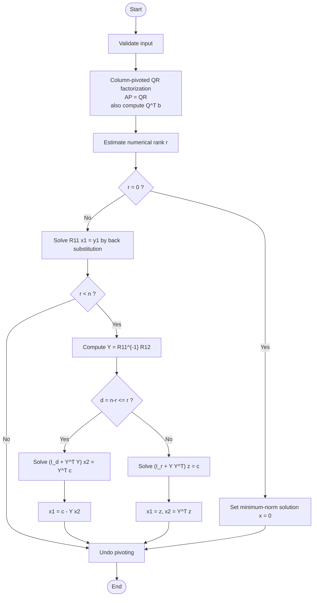

# Theory and Algorithms of LSQSolver

## Overview

`LSQSolver` is a solver for real least-squares problems. Given a real matrix $`A \in \mathbb{R}^{m \times n}`$ and a real vector $`b \in \mathbb{R}^m`$, it solves the linear system $`Ax=b`$ in the least-squares sense. If the residual is denoted by $`r:=Ax-b`$, the basic objective is to minimize the residual norm $`\|r\|`$. When the solution is not unique, `LSQSolver` returns the solution with the smallest norm $`\|x\|`$ among all residual-minimizing solutions. Here, $`\|\cdot\|`$ denotes the Euclidean norm.

The problem solved by `LSQSolver` can be summarized according to the shape and rank of the matrix.

- **When $`m \geq n`$ and $`A`$ has full column rank**: this is the usual overdetermined, or square full-rank, case. `LSQSolver` computes the unique least-squares solution satisfying $`\min_{x \in \mathbb{R}^n}\|Ax-b\|`$.
- **When $`m<n`$ and $`A`$ has full row rank**: this is an underdetermined problem. The equation $`Ax=b`$ generally has infinitely many solutions, and `LSQSolver` computes the minimum-norm solution satisfying $`\min \|x\| \ \mathrm{s.t.}\ Ax=b`$.
- **When $`A`$ is rank-deficient**: the residual-minimizing solution may not be unique. In this case, `LSQSolver` computes the solution satisfying

```math
  \min_{x \in \mbox{argmin}_{z \in \mathbb{R}^n}\|Az-b\|} \|x\|.
  
```

The overall algorithm is as follows.



## Column-Pivoted QR Factorization

`LSQSolver` applies column-pivoted QR factorization to $`A`$ and decomposes it as $`AP=QR`$. Here, $`P \in \mathbb{R}^{n \times n}`$ is a permutation matrix, $`Q \in \mathbb{R}^{m \times m}`$ is an orthogonal matrix, and $`R \in \mathbb{R}^{m \times n}`$ is an upper-triangular or upper-trapezoidal matrix. This factorization triangularizes the column space of $`A`$ by orthogonal transformations while allowing column permutations.

In the implementation, $`Q`$ is not stored explicitly. Instead, the Householder transformations used in the QR factorization are also applied successively to the right-hand side vector $`b`$, resulting in $`y:=Q^Tb`$. This avoids the memory cost of storing $`Q`$ while transforming the least-squares problem into the form $`R\hat{x}\simeq y`$.

### Householder Transformation

At each step of CPQR, the unprocessed part of the current pivot column is extracted, and a Householder transformation is constructed so that all entries except the first one are annihilated. At step $`j`$, let $`a\in\mathbb{R}^{m-j}`$ be the unprocessed part of the selected pivot column. The Householder transformation is represented as

```math
H = I - \tau vv^T.
```

Here, $`v`$ is the Householder vector, $`\tau`$ is a scalar coefficient, and $`H`$ is an orthogonal matrix. Applying this transformation converts $`a`$ into a vector with only its first component nonzero. In other words, the entries below the diagonal element of the pivot column are eliminated.

`LSQSolver` applies this transformation not only to the pivot column but also to the remaining columns and to the right-hand side vector. As a result, the matrix $`A`$ is transformed, in pivot order, into the upper-triangular or upper-trapezoidal matrix $`R`$, and the right-hand side vector $`b`$ is transformed into $`Q^Tb`$. The Householder transformations are used temporarily during the factorization, but the information required to reconstruct $`Q`$ itself is not stored. The solver optionally stores only $`R`$, $`Q^Tb`$, and the pivot information.

### Pivoting Strategy

In ordinary QR factorization, the column order is fixed. In column-pivoted QR factorization, on the other hand, each step selects, among the unprocessed columns, the column with the largest current column norm and uses it as the next pivot column. This strategy moves columns with stronger linear independence toward the front and makes rank detection easier.

More concretely, at step $`j`$, the implementation compares the updated column norms of the unprocessed columns $`j,j+1,\ldots,n-1`$ and selects the largest one. To treat that column as the $`j`$-th pivot column, the implementation swaps entries in the pivot array rather than physically moving the matrix columns. This avoids large memory movement caused by column swaps.

If the selected pivot column norm is below a prescribed tolerance, the remaining columns are not regarded as numerically independent, and the factorization stops. Therefore, in `LSQSolver`, the rank is defined as the number of pivot columns that could be accepted above the tolerance. This is a CPQR-based numerical rank estimate, not an exact singular-value-based rank decision.

### Incremental Column-Norm Update for Pivot Selection

In CPQR, the norms of the unprocessed columns must be compared at each step. A simple implementation could recompute all unprocessed column norms from scratch at every step, but this is expensive. `LSQSolver` therefore uses an incremental column-norm update similar to the technique used in LAPACK's `DGEQP3`.

The implementation stores two norms for each column. One is a working norm used for pivot selection, and the other is a saved norm used as a reference for deciding when recomputation is necessary. During initialization, the exact norm of each column is computed, and both values are set to that norm. After applying one Householder transformation, the norms of the unprocessed columns are approximately downdated. Conceptually, if the current norm of an unprocessed column is $`v`$ and the magnitude of its pivot-row entry is $`|r|`$, the next norm is updated as

```math
 v_{\mathrm{new}} \approx v\sqrt{\max\left(0,1-\left(\frac{|r|}{v}\right)^2\right)}.
```

This makes it possible to update the column norms needed for pivot selection without scanning the entire column at every step.

However, this update is affected by floating-point rounding error. In particular, when the column norm becomes small, cancellation can occur. For this reason, when the working norm becomes sufficiently small relative to the saved norm, the implementation recomputes the norm of the unprocessed part of the column and updates both the working norm and the saved norm. This gives a pivoting strategy that is cheaper than exact recomputation at every step and more stable than relying only on approximate downdates.

### Overall CPQR Algorithm

The CPQR part of `LSQSolver` proceeds roughly as follows.

```text
Input: A, b
Output: R, Q^T b, pivot, rank

1. Compute the initial norm of each column.
2. Initialize the pivot array by pivot[j] = j.
3. Set rank = 0.
4. For j = 0, 1, ..., min(m,n)-1:
   4.1 Find the unprocessed column with the largest updated column norm.
   4.2 Swap that column into the j-th pivot position in the pivot array.
   4.3 If the pivot column norm is below the tolerance, stop the factorization.
   4.4 Construct a Householder transformation from the unprocessed part of the pivot column.
   4.5 Apply the transformation to the remaining columns.
   4.6 Apply the same transformation to b and update Q^T b.
   4.7 Update the unprocessed column norms in a DGEQP3-ish manner.
   4.8 Increment rank by 1.
5. Use the resulting rank as the numerical rank.
```

As a result of this process, the matrix in pivot order becomes upper triangular or upper trapezoidal. In the subsequent solution construction, the block corresponding to the first $`r`$ pivot columns is denoted by $`R_{11}`$, and the block corresponding to the remaining free variables is denoted by $`R_{12}`$.

For numerical rank detection, let $`s:=\max_{1\leq j\leq n}\|a_j\|`$ be the maximum initial column norm, where $`a_j`$ is the $`j`$-th column of $`A`$. The tolerance is defined as

```math
\tau := \max\left(\text{rank\_tolerance}\cdot \max\{m,n\}\cdot s,\ \varepsilon\right),
```

where $`\varepsilon`$ is the unit roundoff scale for double-precision floating-point arithmetic. Since the factorization stops when the selected pivot column norm becomes less than or equal to $`\tau`$, the numerical rank $`r`$ is the number of pivots accepted above the tolerance.

From CPQR, we have $`A=QRP^T`$. Letting $`\hat{x}:=P^Tx`$ and $`y:=Q^Tb`$, the orthogonality of $`Q`$ gives

```math
\|Ax-b\| = \|QRP^Tx-b\| = \|R\hat{x}-y\|.
```

Thus, the original problem is reduced to the problem $`R\hat{x}\simeq y`$ in the pivoted variable $`\hat{x}`$. Once a solution is obtained in this pivoted order, the original variable order is restored by $`x=P\hat{x}`$.

## Case: $`m \geq n`$ and $`A`$ Has Full Column Rank

In this case, $`\mbox{rank}(A)=n`$. After CPQR, $`R`$ and $`y`$ can be partitioned as

```math
R =
\begin{pmatrix}
R_{11} \\
O
\end{pmatrix},
\qquad
 y =
\begin{pmatrix}
y_1 \\
y_2
\end{pmatrix},
\qquad
R_{11} \in \mathbb{R}^{n \times n},\quad y_1 \in \mathbb{R}^{n}.
```

Here, $`R_{11}`$ is a nonsingular upper-triangular matrix. The residual norm can be decomposed as

```math
\|R\hat{x}-y\|^2
=
\|R_{11}\hat{x}-y_1\|^2+
\|y_2\|^2.
```

The second term does not depend on $`\hat{x}`$, so minimizing the residual norm is equivalent to satisfying $`R_{11}\hat{x}=y_1`$. Therefore, the solution is uniquely given by

```math
\hat{x}=R_{11}^{-1}y_1.
```

In the implementation, the inverse matrix is not formed explicitly. Instead, this upper-triangular system is solved by back substitution.

## Case: $`m<n`$ and $`A`$ Has Full Row Rank

In this case, $`\mbox{rank}(A)=m`$. After CPQR, $`R`$ and the unknown vector are partitioned as

```math
R =
\begin{pmatrix}
R_{11} & R_{12}
\end{pmatrix},
\qquad
\hat{x}=
\begin{pmatrix}
\hat{x}_1 \\
\hat{x}_2
\end{pmatrix},
```

where $`R_{11}\in\mathbb{R}^{m\times m}`$, $`R_{12}\in\mathbb{R}^{m\times(n-m)}`$, $`\hat{x}_1\in\mathbb{R}^m`$, and $`\hat{x}_2\in\mathbb{R}^{n-m}`$. The matrix $`R_{11}`$ is a nonsingular upper-triangular matrix, and the equation becomes

```math
R_{11}\hat{x}_1+R_{12}\hat{x}_2 = y.
```

Since $`A`$ has full row rank, a solution exists for any $`y\in\mathbb{R}^m`$. However, because $`n>m`$, the solution is generally not unique. Therefore, the solution with the smallest norm must be selected from the solution set.

## Case: $`A`$ Is Rank-Deficient

In general, let the numerical rank be $`r=\mbox{rank}(A)<\min\{m,n\}`$. After CPQR, $`R`$, $`\hat{x}`$, and $`y`$ are partitioned according to the rank $`r`$ as

```math
R =
\begin{pmatrix}
R_{11} & R_{12} \\
O      & O
\end{pmatrix},
\qquad
\hat{x}=
\begin{pmatrix}
\hat{x}_1 \\
\hat{x}_2
\end{pmatrix},
\qquad
 y =
\begin{pmatrix}
y_1 \\
y_2
\end{pmatrix}.
```

Here, $`R_{11}\in\mathbb{R}^{r\times r}`$, $`R_{12}\in\mathbb{R}^{r\times(n-r)}`$, $`\hat{x}_1,y_1\in\mathbb{R}^r`$, $`\hat{x}_2\in\mathbb{R}^{n-r}`$, and $`y_2\in\mathbb{R}^{m-r}`$. The matrix $`R_{11}`$ is a nonsingular upper-triangular matrix. In this case, the residual norm is

```math
\|R\hat{x}-y\|^2
=
\|R_{11}\hat{x}_1+R_{12}\hat{x}_2-y_1\|^2+
\|y_2\|^2.
```

The second term does not depend on $`\hat{x}`$, so minimizing the residual norm is equivalent to satisfying $`R_{11}\hat{x}_1+R_{12}\hat{x}_2=y_1`$. However, the solutions satisfying this condition are generally not unique, so a minimum-norm solution must be constructed. In particular, when $`r=0`$, $`R`$ is regarded as numerically zero, and the residual norm does not depend on $`x`$. Therefore, the minimum-norm solution is $`\hat{x}=0`$.

## Construction of the Minimum-Norm Solution

Consider the case where the residual-minimizing $`\hat{x}`$ is not unique, either because the problem is full-row-rank underdetermined with $`m<n`$, or because the matrix is rank-deficient. In both cases, by regarding the full-row-rank underdetermined case as $`r=m`$, the residual-minimization condition can be written as

```math
R_{11}\hat{x}_1+R_{12}\hat{x}_2=y_1.
```

Since $`R_{11}`$ is nonsingular, define $`Y:=R_{11}^{-1}R_{12}`$ and $`c:=R_{11}^{-1}y_1`$. Then this condition is equivalent to $`\hat{x}_1+Y\hat{x}_2=c`$. Therefore, the set of all residual-minimizing solutions is

```math
S=
\left\{
\begin{pmatrix}
c-Y\hat{x}_2 \\
\hat{x}_2
\end{pmatrix}
:\
\hat{x}_2\in\mathbb{R}^{n-r}
\right\}.
```

To find the solution with the smallest norm in this set, solve the minimization problem

```math
\min_{\hat{x}_2\in\mathbb{R}^{n-r}}
\left(\|c-Y\hat{x}_2\|^2+\|\hat{x}_2\|^2\right).
```

The corresponding normal equation is

```math
(I_{n-r}+Y^TY)\hat{x}_2=Y^Tc.
```

Since the coefficient matrix $`I_{n-r}+Y^TY`$ is symmetric positive definite, $`\hat{x}_2`$ is uniquely determined. Then $`\hat{x}_1`$ is obtained from $`\hat{x}_1=c-Y\hat{x}_2`$.

However, when $`n-r`$ is large, solving this normal equation directly results in a large linear system. Therefore, `LSQSolver` uses the following identities to solve the smaller symmetric positive definite system.

> **Lemma 1**
>
> For any $`Y\in\mathbb{R}^{r\times(n-r)}`$,
>
> ```math
> (I_{n-r}+Y^TY)Y^T = Y^T(I_r+YY^T)
> 
>```
>
> holds. Indeed, expanding the left-hand side gives $`Y^T+Y^TYY^T`$, which is equal to $`Y^T(I_r+YY^T)`$.

> **Lemma 2**
>
> Since $`I_{n-r}+Y^TY`$ and $`I_r+YY^T`$ are both symmetric positive definite, they are nonsingular. Multiplying the identity in Lemma 1 by the corresponding inverses gives
>
> ```math
> (I_{n-r}+Y^TY)^{-1}Y^T
> =
> Y^T(I_r+YY^T)^{-1}.
> 
>```

Therefore, $`\hat{x}_2`$ can be expressed in either of the following forms.

```math
\hat{x}_2=(I_{n-r}+Y^TY)^{-1}Y^Tc
=Y^T(I_r+YY^T)^{-1}c.
```

This relation shows that it is sufficient to solve the smaller of the two symmetric positive definite systems, with sizes $`d:=n-r`$ and $`r`$. In the implementation, inverse matrices are not formed explicitly; the corresponding linear systems are solved by Cholesky factorization.

### Case: $`d=n-r \leq r`$

In this case, the $`d`$-dimensional linear system

```math
(I_d+Y^TY)\hat{x}_2=Y^Tc
```

is solved, and the solution is then constructed by $`\hat{x}_1=c-Y\hat{x}_2`$.

### Case: $`d=n-r>r`$

In this case, the $`r`$-dimensional linear system

```math
(I_r+YY^T)z=c
```

is solved. For the resulting $`z=(I_r+YY^T)^{-1}c`$, the minimum-norm solution is given by

```math
\hat{x}_1=z,
\qquad
\hat{x}_2=Y^Tz.
```

Indeed, Lemma 2 gives $`\hat{x}_2=Y^T(I_r+YY^T)^{-1}c=Y^Tz`$. Furthermore, $`\hat{x}_1=c-Y\hat{x}_2=c-YY^T(I_r+YY^T)^{-1}c=(I_r+YY^T)^{-1}c=z`$.

## Solution by Cholesky Factorization

The matrices $`I_d+Y^TY`$ and $`I_r+YY^T`$ that appear in the construction of the minimum-norm solution are both symmetric positive definite. Therefore, `LSQSolver` denotes the target symmetric positive definite matrix by $`\Sigma`$ and applies the Cholesky factorization

```math
\Sigma=LL^T.
```

Here, $`L`$ is a lower-triangular matrix. The linear system $`\Sigma u=g`$ is solved by first solving $`Lv=g`$ by forward substitution and then solving $`L^Tu=v`$ by back substitution. In this way, the minimum-norm solution is constructed through triangular solves without explicitly forming an inverse matrix.

## Recovering the Final Solution

The solution $`\hat{x}`$ obtained so far is expressed in the variable order after column pivoting by CPQR. The solution in the original variable order is obtained by $`x=P\hat{x}`$. Therefore, the algorithm of `LSQSolver` can be summarized as follows.

1. Compute the column-pivoted QR factorization $`AP=QR`$.
2. Apply the same orthogonal transformations to $`b`$ and obtain $`y=Q^Tb`$.
3. Estimate the numerical rank $`r`$ from the pivot column norms.
4. Solve $`R_{11}\hat{x}_1=y_1`$ by back substitution.
5. If necessary, perform minimum-norm completion using $`Y=R_{11}^{-1}R_{12}`$.
6. Undo the pivoting and return the solution $`x=P\hat{x}`$ in the original variable order.

## Discussion

`LSQSolver` currently solves the symmetric positive definite systems arising in the minimum-norm completion for rank-deficient or underdetermined problems directly by Cholesky factorization. One possible future direction is to replace this stage with CG or preconditioned CG, aiming to make it faster than Cholesky when favorable and no worse than Cholesky otherwise. The key issue is how to control the conditioning of $`Y=R_{11}^{-1}R_{12}`$, $`Y^TY`$, or $`YY^T`$; possible approaches include SRRQR and effective preconditioning. However, because the current implementation targets dense matrices, CG is unlikely to outperform the direct method unless the number of iterations is sufficiently small. Any insight on switching criteria, preconditioners, stopping conditions, combinations with SRRQR, or other implementation techniques would be valuable. Ideas for improving the minimum-norm completion step or the overall CPQR procedure are also welcome.

## References

- Steve Marschner, *QR factorization and orthogonal transformations*, Cornell University, 2009.  
  <https://www.cs.cornell.edu/courses/cs3220/2009sp/notes/qr.pdf>

- LAPACK, *DGEQP3: QR factorization with column pivoting*.  
  <https://www.netlib.org/lapack/explore-html/d0/dea/group__geqp3_gae96659507d789266660af28c617ef87f.html>

- LAPACK Users' Guide, *QR Factorization with Column Pivoting*.  
  <https://www.netlib.org/lapack/lug/node42.html>

- LAPACK, *DLAQP2: QR factorization with column pivoting of a matrix block*.  
  <https://www.netlib.org/lapack/explore-html/dc/db8/group__laqp2_gaf8ebda4d584de0767a5563dc3fd62fb6.html>

- Benjamin Daniel, Arvind Saibaba, and Ilse Ipsen, *Rank Revealing QR Factorizations*, RTG Slides, North Carolina State University, 2020.  
  <https://wp.math.ncsu.edu/rna/wp-content/uploads/sites/7/2020/09/RTG_Slides_7-24.pdf>

- Wikipedia contributors, *QR decomposition*, Wikipedia.  
  <https://en.wikipedia.org/wiki/QR_decomposition>
