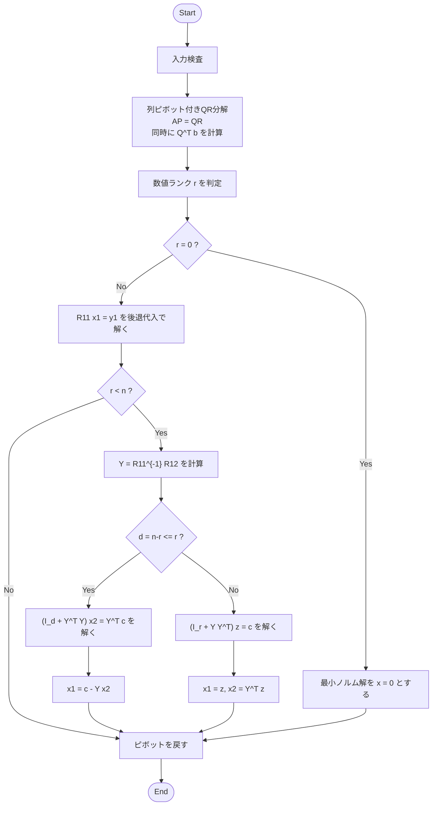

# LSQSolver の理論とアルゴリズム

## 概要

`LSQSolver` は、実行列 $`A \in \mathbb{R}^{m \times n}`$ と実ベクトル $`b \in \mathbb{R}^m`$ に対して、線形方程式 $`Ax=b`$ を最小二乗の意味で解くソルバーです。残差を $`r:=Ax-b`$ とおくと、基本的には残差ノルム $`\|r\|`$ を最小にする解を求めます。ただし、解が一意に定まらない場合には、残差ノルムを最小にする解の中でさらにノルム $`\|x\|`$ が最小となる解を返します。ここで $`\|\cdot\|`$ はユークリッドノルムを表します。

解く問題は、行列の形とランクに応じて次のように整理できます。

- **$`m \geq n`$ かつ $`A`$ がフル列ランクの場合**：通常の過決定または正方フルランク問題であり、$`\min_{x \in \mathbb{R}^n}\|Ax-b\|`$ を満たす一意な最小二乗解を求めます。
- **$`m<n`$ かつ $`A`$ がフル行ランクの場合**：劣決定問題であり、$`Ax=b`$ を満たす解は一般に無数に存在する。このとき、$`\min \|x\| \ \mathrm{s.t.}\ Ax=b`$ を満たす最小ノルム解を求めます。
- **$`A`$ がランク落ちしている場合**：残差ノルムを最小にする解が一意に定まらない場合がありますため、

```math
  \min_{x \in \mbox{argmin}_{z \in \mathbb{R}^n}\|Az-b\|} \|x\|
  
```

  を満たす解を求めます。

アルゴリズム全体の流れは以下の通りです。



## 列ピボット付きQR分解

`LSQSolver` は、行列 $`A`$ に対して列ピボット付きQR分解を適用し、$`AP=QR`$ と分解します。ここで、$`P \\in \\mathbb{R}^{n \\times n}`$ は置換行列、$`Q \\in \\mathbb{R}^{m \\times m}`$ は直交行列、$`R \\in \\mathbb{R}^{m \\times n}`$ は上三角または上台形の行列です。この分解により、列の入れ替えを許しながら、$`A`$ の列空間を直交変換によって段階的に三角化します。

実装では、$`Q`$ を明示的な行列として保持しません。代わりに、QR分解で用いるハウスホルダー変換を右辺ベクトル $`b`$ にも逐次適用し、最終的に $`y:=Q^Tb`$ を得ます。これにより、$`Q`$ の保存に必要なメモリを避けつつ、最小二乗問題を $`R\\hat{x}\\simeq y`$ の形へ変換します。

### ハウスホルダー変換

CPQR の各ステップでは、現在のピボット列の未処理部分を取り出し、その第1成分以外を零にするようなハウスホルダー変換を構成します。ステップ $`j`$ において、選ばれたピボット列の未処理部分を $`a\in\mathbb{R}^{m-j}`$ とすると、ハウスホルダー変換は

```math
H = I - \tau vv^T
```

の形で表されます。ここで、$`v`$ はハウスホルダーベクトル、$`\tau`$ はスカラー係数であり、$`H`$ は直交行列です。この変換を用いると、$`Ha`$ は第1成分のみを持つベクトルに変換されます。すなわち、ピボット列の対角成分より下の成分を零にできます。

`LSQSolver` では、この変換をピボット列だけでなく、残りの列および右辺ベクトルにも同時に適用します。この処理により、行列 $`A`$ はピボット順に上三角または上台形の行列 $`R`$ へ変換され、右辺ベクトル $`b`$ は $`Q^Tb`$ へ変換されます。なお、ハウスホルダー変換は計算中に一時的に使われますが、分解後に $`Q`$ 自体を再構成するための情報は保持しません。最終的に保持されるのは、必要に応じて $`R`$、$`Q^Tb`$、およびピボット情報です。

### ピボット戦略

通常のQR分解では、列の順序を固定したまま三角化を行います。一方、列ピボット付きQR分解では、各ステップで未処理列の中から「現在もっとも大きい列ノルムを持つ列」を選び、それを次のピボット列とします。この戦略により、線形独立性の強い列を前方に集め、ランク判定を行いやすくします。

具体的には、ステップ $`j`$ において未処理列 $`j,j+1,\ldots,n-1`$ の更新済み列ノルムを比較し、最大のものを選ぶ。その列を $`j`$ 番目のピボット列として扱うため、実装では実データ列を物理的に入れ替えるのではなく、ピボット配列を入れ替える。この方式により、列入れ替えに伴う大きなメモリ移動を避ける。

選ばれたピボット列ノルムが、あらかじめ定めた許容値以下になった場合、それ以降の列は数値的に独立な列として扱われず、そこで分解を打ち切ります。したがって、`LSQSolver` におけるランクは、許容値を超えて採用できたピボット列の本数として定まります。これは SVD に基づく厳密な特異値判定ではなく、CPQR に基づく数値ランク判定です。

### ピボット選択における列ノルムの逐次更新

CPQR では、各ステップで未処理列のノルムを比較する必要があります。単純には、各ステップで全ての未処理列ノルムを最初から計算し直せばよいですが、これは高コストです。そこで `LSQSolver` では、LAPACK の `DGEQP3` で使われる手法に近い、列ノルムの逐次更新を用いています。

実装では、各列について2種類のノルムを保持します。ひとつは現在のピボット選択に使う作業用ノルム、もうひとつは再計算判定の基準として使う保存用ノルムです。初期化時には、各列のノルムを正確に計算し、両方に同じ値を入れます。ハウスホルダー変換を1ステップ適用した後は、未処理列のノルムを近似的にダウンデートします。概念的には、ある未処理列の現在ノルムを $`v`$、その列のピボット行成分の大きさを $`|r|`$ とすると、次のノルムを

```math
 v_{\mathrm{new}} \approx v\sqrt{\max\left(0,1-\left(\frac{|r|}{v}\right)^2\right)}
```

のように更新する。これにより、列全体を毎回走査せずに、ピボット選択に必要な列ノルムを安価に更新できる。

ただし、この更新は浮動小数点演算による丸め誤差の影響を受けます。特に列ノルムが小さくなってきた場合、差の計算による桁落ちが生じやすいです。そのため、作業用ノルムが保存用ノルムに比べて十分小さくなった場合には、未処理部分の列ノルムを実際に再計算し、作業用ノルムと保存用ノルムを更新します。この仕組みにより、毎回正確なノルムを計算するより軽く、単純な近似更新だけに頼るより安定したピボット選択ができます。

### CPQRの全体アルゴリズム

以上をまとめると、`LSQSolver` のCPQR部分は、大まかには次のように進む。

```text
入力: A, b
出力: R, Q^T b, pivot, rank

1. 各列の初期ノルムを計算する。
2. pivot[j] = j としてピボット配列を初期化する。
3. rank = 0 とする。
4. j = 0, 1, ..., min(m,n)-1 について以下を行う。
   4.1 未処理列の中で、更新済み列ノルムが最大の列を探す。
   4.2 その列を j 番目のピボット列としてピボット配列上で入れ替える。
   4.3 ピボット列ノルムが許容値以下なら、ここで分解を打ち切る。
   4.4 ピボット列の未処理部分からハウスホルダー変換を構成する。
   4.5 その変換を残りの列に適用する。
   4.6 同じ変換を右辺ベクトル b に適用し、Q^T b を更新する。
   4.7 未処理列のノルムを DGEQP3-ish に更新する。
   4.8 rank を 1 増やす。
5. 得られた rank を数値ランクとする。
```

この処理の結果、ピボット順に見た行列は上三角または上台形の形になる。以降の解構成では、先頭 $`r`$ 本のピボット列に対応するブロックを $`R_{11}`$、残りの自由変数に対応するブロックを $`R_{12}`$ として扱う。

数値ランク判定では、初期列ノルムの最大値を $`s:=\max_{1\leq j\leq n}\|a_j\|`$ とし、許容値を

```math
\tau := \max\left(\text{rank\_tolerance}\cdot \max\{m,n\}\cdot s,\ \varepsilon\right)
```

と定めます。ここで、$`a_j`$ は $`A`$ の第 $`j`$ 列ベクトル、$`\varepsilon`$ は倍精度浮動小数点数の丸め誤差スケールです。各ステップで選ばれたピボット列ノルムが $`\tau`$ 以下になった時点で分解を打ち切るため、数値ランク $`r`$ は「許容値を超えて採用できたピボット数」として定まります。

CPQR の結果から $`A=QRP^T`$ が成り立ちます。そこで、$`\hat{x}:=P^Tx`$、$`y:=Q^Tb`$ とおくと、$`Q`$ の直交性より

```math
\|Ax-b\| = \|QRP^Tx-b\| = \|R\hat{x}-y\|
```

です。よって、元の問題はピボット後の変数 $`\hat{x}`$ に関する問題 $`R\hat{x}\simeq y`$ に帰着されます。この問題で得られた解を最後に $`x=P\hat{x}`$ と戻せば、元の変数順の解が得られます。

## $`m \geq n`$ かつ $`A`$ がフル列ランクの場合

この場合は $`\mbox{rank}(A)=n`$ であり、CPQR 後の $`R`$ と $`y`$ は次のように分けられる。

```math
R =
\begin{pmatrix}
R_{11} \\
O
\end{pmatrix},
\qquad
 y =
\begin{pmatrix}
y_1 \\
y_2
\end{pmatrix},
\qquad
R_{11} \in \mathbb{R}^{n \times n},\quad y_1 \in \mathbb{R}^{n}.
```

ここで、$`R_{11}`$ は正則な上三角行列です。残差ノルムは

```math
\|R\hat{x}-y\|^2
=
\|R_{11}\hat{x}-y_1\|^2+
\|y_2\|^2
```

と分解できます。第2項は $`\hat{x}`$ に依存しないため、残差ノルムを最小にするには $`R_{11}\hat{x}=y_1`$ を満たせばよいです。したがって、解は一意に

```math
\hat{x}=R_{11}^{-1}y_1
```

で与えられます。実装では逆行列を明示的に作らず、後退代入により上三角方程式を解きます。

## $`m<n`$ かつ $`A`$ がフル行ランクの場合

この場合は $`\mbox{rank}(A)=m`$ であり、CPQR 後の $`R`$ と未知ベクトルを次のように分ける。

```math
R =
\begin{pmatrix}
R_{11} & R_{12}
\end{pmatrix},
\qquad
\hat{x}=
\begin{pmatrix}
\hat{x}_1 \\
\hat{x}_2
\end{pmatrix},
```

ただし、$`R_{11}\in\mathbb{R}^{m\times m}`$、$`R_{12}\in\mathbb{R}^{m\times(n-m)}`$、$`\hat{x}_1\in\mathbb{R}^m`$、$`\hat{x}_2\in\mathbb{R}^{n-m}`$ です。$`R_{11}`$ は正則な上三角行列であり、方程式は

```math
R_{11}\hat{x}_1+R_{12}\hat{x}_2 = y
```

となります。$`A`$ はフル行ランクなので任意の $`y\in\mathbb{R}^m`$ に対して解は存在しますが、$`n>m`$ ですので一般には一意ではありません。そのため、解集合の中から $`\|\hat{x}\|`$ が最小となる解を選ぶ必要があります。

## $`A`$ がランク落ちしている場合

一般に、数値ランクを $`r=\\mbox{rank}(A)<\\min\\{m,n\\}`$ とします。CPQR 後の $`R`$、$`\\hat{x}`$、$`y`$ は、ランク $`r`$ に応じて次のように分けられます。

```math
R =
\begin{pmatrix}
R_{11} & R_{12} \\
O      & O
\end{pmatrix},
\qquad
\hat{x}=
\begin{pmatrix}
\hat{x}_1 \\
\hat{x}_2
\end{pmatrix},
\qquad
 y =
\begin{pmatrix}
y_1 \\
y_2
\end{pmatrix}.
```

ここで、$`R_{11}\in\mathbb{R}^{r\times r}`$、$`R_{12}\in\mathbb{R}^{r\times(n-r)}`$、$`\hat{x}_1,y_1\in\mathbb{R}^r`$、$`\hat{x}_2\in\mathbb{R}^{n-r}`$、$`y_2\in\mathbb{R}^{m-r}`$ です。また、$`R_{11}`$ は正則な上三角行列です。このとき、残差ノルムは

```math
\|R\hat{x}-y\|^2
=
\|R_{11}\hat{x}_1+R_{12}\hat{x}_2-y_1\|^2+
\|y_2\|^2
```

と書けます。第2項は $`\\hat{x}`$ に依存しないため、残差ノルムを最小にするには $`R_{11}\\hat{x}_1+R_{12}\\hat{x}_2=y_1`$ を満たせばよいです。ただし、この条件を満たす解は一般に一意ではないため、最小ノルム解を構成する必要があります。特に $`r=0`$ の場合、$`R`$ は数値的に零行列と見なされ、残差ノルムは $`x`$ に依存しません。したがって、最小ノルム解は $`\\hat{x}=0`$ です。

## 最小ノルム解の構成

以下では、$`m<n`$ のフル行ランク問題、またはランク落ち問題により、残差ノルムを最小にする $`\hat{x}`$ が一意に定まらない場合を考えます。いずれの場合も、フル行ランクの劣決定問題では $`r=m`$ とみなせば、残差ノルム最小条件は

```math
R_{11}\hat{x}_1+R_{12}\hat{x}_2=y_1
```

と書けます。$`R_{11}`$ は正則なので、$`Y:=R_{11}^{-1}R_{12}`$、$`c:=R_{11}^{-1}y_1`$ とおけば、この条件は $`\hat{x}_1+Y\hat{x}_2=c`$ と同値です。したがって、残差ノルムを最小にする解全体は

```math
S=
\left\{
\begin{pmatrix}
c-Y\hat{x}_2 \\
\hat{x}_2
\end{pmatrix}
:\
\hat{x}_2\in\mathbb{R}^{n-r}
\right\}
```

で与えられます。この中でノルム最小の解を求めるには、$`\\hat{x}_2`$ に関する最小化問題

```math
\min_{\hat{x}_2\in\mathbb{R}^{n-r}}
\left(\|c-Y\hat{x}_2\|^2+\|\hat{x}_2\|^2\right)
```

を解けばよいです。この最適化問題に対応する正規方程式として、

```math
(I_{n-r}+Y^TY)\hat{x}_2=Y^Tc
```

を得ます。係数行列 $`I_{n-r}+Y^TY`$ は対称正定値ですので、$`\\hat{x}_2`$ は一意に定まり、その後 $`\\hat{x}_1=c-Y\\hat{x}_2`$ によって $`\\hat{x}_1`$ も定まります。

ただし、$`n-r`$ が大きい場合、この正規方程式をそのまま解くと大きな線形方程式になります。そこで、`LSQSolver` では次の関係を用いて、より小さい方の対称正定値系を解きます。

> **補題1**
>
> 任意の $`Y\in\mathbb{R}^{r\times(n-r)}`$ に対して、
>
> ```math
> (I_{n-r}+Y^TY)Y^T = Y^T(I_r+YY^T)
> 
>```
>
> が成り立つ。実際、左辺を展開すると $`Y^T+Y^TYY^T`$ となり、これは $`Y^T(I_r+YY^T)`$ に等しい。

> **補題2**
>
> $`I_{n-r}+Y^TY`$ および $`I_r+YY^T`$ はいずれも対称正定値ですので正則であり、補題1の両側から逆行列を掛けることで
>
> ```math
> (I_{n-r}+Y^TY)^{-1}Y^T
> =
> Y^T(I_r+YY^T)^{-1}
> 
>```
>
> を得る。

したがって、$`\hat{x}_2`$ は次のいずれの形でも表せる。

```math
\hat{x}_2=(I_{n-r}+Y^TY)^{-1}Y^Tc
=Y^T(I_r+YY^T)^{-1}c.
```

この関係により、$`d:=n-r`$ と $`r`$ のうち小さい方のサイズの対称正定値線形方程式を解けばよいです。実装では逆行列を明示的に作らず、Cholesky 分解により線形方程式を解きます。

### $`d=n-r \leq r`$ の場合

この場合は、$`d`$ 次元の線形方程式

```math
(I_d+Y^TY)\hat{x}_2=Y^Tc
```

を解き、その後に $`\hat{x}_1=c-Y\hat{x}_2`$ として解を構成する。

### $`d=n-r>r`$ の場合

この場合は、$`r`$ 次元の線形方程式

```math
(I_r+YY^T)z=c
```

を解きます。得られた $`z=(I_r+YY^T)^{-1}c`$ に対して、最小ノルム解は

```math
\hat{x}_1=z,
\qquad
\hat{x}_2=Y^Tz
```

で与えられる。実際、補題2より $`\hat{x}_2=Y^T(I_r+YY^T)^{-1}c=Y^Tz`$ であり、さらに $`\hat{x}_1=c-Y\hat{x}_2=c-YY^T(I_r+YY^T)^{-1}c=(I_r+YY^T)^{-1}c=z`$ となる。

## Cholesky 分解による求解

最小ノルム解の構成で現れる $`I_d+Y^TY`$ および $`I_r+YY^T`$ は、いずれも対称正定値行列です。そのため、`LSQSolver` では対象となる対称正定値行列を $`\Sigma`$ とおき、Cholesky 分解

```math
\Sigma=LL^T
```

を行います。ここで $`L`$ は下三角行列です。線形方程式 $`\Sigma u=g`$ は、まず前進代入で $`Lv=g`$ を解き、次に後退代入で $`L^Tu=v`$ を解くことで求めます。このように、逆行列を明示的に構成せず、三角行列に対する代入計算によって最小ノルム解を構成します。

## 最終的な解の復元

ここまでで得られる解 $`\hat{x}`$ は、CPQR による列ピボット後の変数順に対応しています。元の変数順の解は $`x=P\hat{x}`$ により得られます。したがって、`LSQSolver` の解法は次のようにまとめられます。

1. 列ピボット付きQR分解により $`AP=QR`$ を構成します。
2. 同じ直交変換を $`b`$ に適用し、$`y=Q^Tb`$ を得ます。
3. ピボット列ノルムに基づいて数値ランク $`r`$ を判定します。
4. $`R_{11}\hat{x}_1=y_1`$ を後退代入で解きます。
5. 必要に応じて、$`Y=R_{11}^{-1}R_{12}`$ を用いて最小ノルム補完を行います。
6. ピボットを戻し、元の変数順の解 $`x=P\hat{x}`$ を返します。


## 議論

`LSQSolver` では現在、ランク落ちまたは劣決定問題の最小ノルム補完で現れる対称正定値系を Cholesky 分解で直接解いている。一方で、この後段を CG 法または前処理付き CG 法に置き換え、「有利な場合は Cholesky より速く、そうでない場合でも Cholesky と同程度」にできるかに関心がある。キーポイントは、($`Y=R_{11}^{-1}R_{12}`$)、($`(Y^TY)~(YY^T)`$) の条件数をどう抑えるかであり、SRRQR や前処理の導入が候補になると考えている。ただし、密行列では CG の反復回数が十分少なくならない限り直接法と比較した場合の効率化、切り替え基準、前処理、停止条件、SRRQR との組み合わせについて知見があれば参考にしたい。また、CG に限らず、最小ノルム補完や CPQR 全体の効率化に関する意見も歓迎する。


## 参考文献・参考資料

- Steve Marschner, *QR factorization and orthogonal transformations*, Cornell University, 2009.  
  <https://www.cs.cornell.edu/courses/cs3220/2009sp/notes/qr.pdf>

- LAPACK, *DGEQP3: QR factorization with column pivoting*.  
  <https://www.netlib.org/lapack/explore-html/d0/dea/group__geqp3_gae96659507d789266660af28c617ef87f.html>

- LAPACK Users' Guide, *QR Factorization with Column Pivoting*.  
  <https://www.netlib.org/lapack/lug/node42.html>

- LAPACK, *DLAQP2: QR factorization with column pivoting of a matrix block*.  
  <https://www.netlib.org/lapack/explore-html/dc/db8/group__laqp2_gaf8ebda4d584de0767a5563dc3fd62fb6.html>

- Benjamin Daniel, Arvind Saibaba, and Ilse Ipsen, *Rank Revealing QR Factorizations*, RTG Slides, North Carolina State University, 2020.  
  <https://wp.math.ncsu.edu/rna/wp-content/uploads/sites/7/2020/09/RTG_Slides_7-24.pdf>

- Wikipedia contributors, *QR decomposition*, Wikipedia.  
  <https://en.wikipedia.org/wiki/QR_decomposition>
